# Architecture Diagrams

## Purpose

This document provides **visual architecture diagrams** for the runtime.

These diagrams complement the detailed architecture contracts and make the system shape explicit.

They focus on:

- runtime boundaries;
- canonical vs ephemeral state;
- control and execution flows;
- authorization;
- cognitive context and memory;
- recursive orchestration;
- scheduling;
- transactions and forks;
- local client/runtime separation;
- storage layout.

All diagrams use Mermaid so they render directly on GitHub and remain versioned with the architecture.

---

# 1. System context

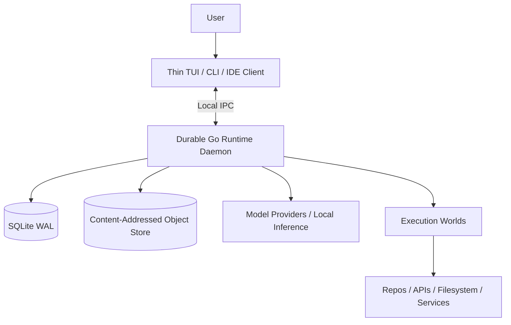

### Reading

- the client is **not** the owner of agent state;
- the daemon owns canonical runtime state;
- SQLite stores canonical metadata, events and projections;
- large payloads live in the object store;
- models and Worlds are external execution resources.

---

# 2. Internal runtime architecture

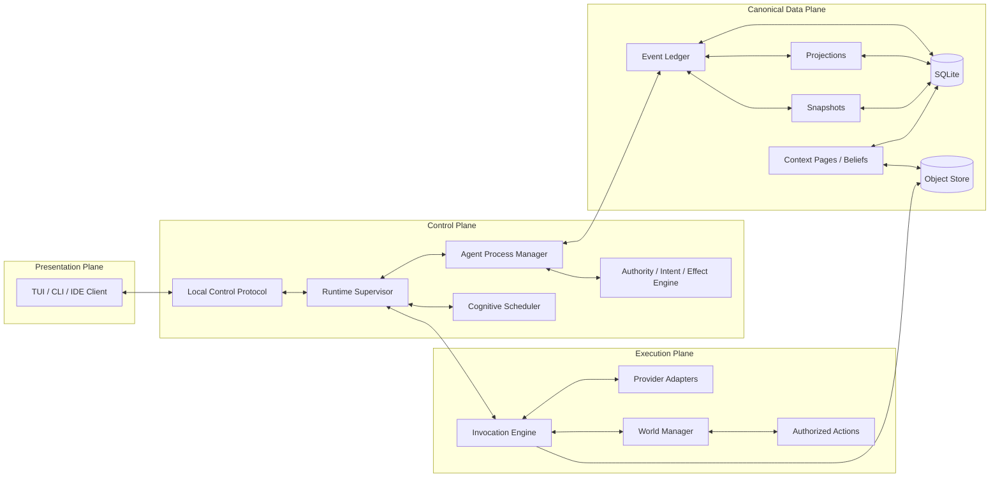

### Architectural law

The runtime is explicitly separated into four concerns:

- **presentation plane** — attachable clients;
- **control plane** — state machines, scheduling and authorization;
- **canonical data plane** — durable state and evidence;
- **execution plane** — model and World execution.

---

# 3. Canonical vs ephemeral state

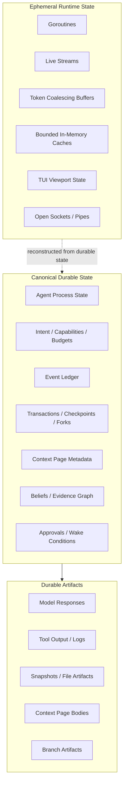

### Invariant

If correctness depends on a fact after a crash, that fact must have crossed a durable storage boundary.

---

# 4. End-to-end interaction flow

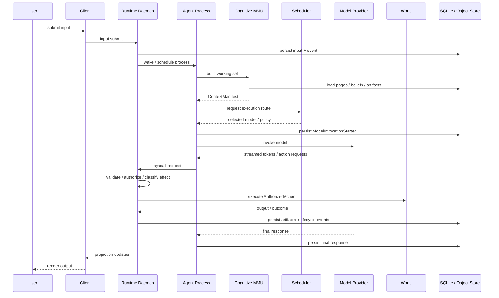

---

# 5. Authorization pipeline

```mermaid
flowchart LR
    Req[Requested Action] --> Validate[Validate Action Shape]
    Validate --> Effect[Derive Effect Descriptor]
    Effect --> Proc[Check Process Lifecycle]
    Proc --> Cap[Check Capabilities / Leases]
    Cap --> Intent[Check Intent Compatibility]
    Intent --> Budget[Check Budgets / Quotas]
    Budget --> Tx[Check Transaction / Speculation Policy]
    Tx --> Approval{Approval Required?}
    Approval -- Yes --> UserApproval[Obtain Approval Token]
    Approval -- No --> WorldPolicy[Check World Enforcement Capability]
    UserApproval --> WorldPolicy
    WorldPolicy --> Decision[AuthorizedAction or Denial]
    Decision --> Exec[World Execution]
```

### Law

The model can request an action.

It cannot bypass the kernel authorization pipeline.

---

# 6. Cognitive MMU and Context Fault flow

```mermaid
flowchart TB
    subgraph DurableKnowledge[Durable Knowledge Base]
        Pages[Context Pages]
        Beliefs[Beliefs]
        Evidence[Evidence / Artifacts]
        Index[FTS / Retrieval Index]
    end

    subgraph WorkingSet[Working Set Builder]
        T0[Tier 0 Mandatory]
        T1[Tier 1 Active State]
        T2[Tier 2 Explicit Recall]
        T3[Tier 3 Relevant Durable Pages]
        T4[Tier 4 Recent Continuity]
        Pack[Pack / Trim / Emit ContextManifest]
    end

    Invoke[Invocation Request] --> T0
    Invoke --> T1
    Pages --> T2
    Beliefs --> T2
    Evidence --> T2
    Index --> T3
    Pages --> T3
    Beliefs --> T3

    T0 --> Pack
    T1 --> Pack
    T2 --> Pack
    T3 --> Pack
    T4 --> Pack
    Pack --> Prompt[Bounded Provider Request]

    Missing[Missing Reference / recall()] --> Fault[Context Fault Resolver]
    Fault --> Index
    Fault --> Pages
    Fault --> Beliefs
    Fault --> Evidence
    Fault --> T2
```

### Principle

The LLM context window is a **working-set cache**, not the memory system itself.

---

# 7. Epistemic memory model

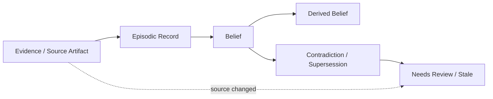

### Principle

- raw evidence remains inspectable;
- beliefs carry provenance;
- source changes downgrade dependent knowledge instead of silently deleting history.

---

# 8. Recursive orchestration and subagents

```mermaid
flowchart TB
    Root[Root Agent Process]
    Reserve[Reserve Budget + Authority Subset]
    Spawn[spawn()]

    Root --> Reserve --> Spawn

    subgraph Team[Temporary Agent Organization]
        A1[Backend Agent]
        A2[Test Agent]
        A3[Security Agent]
        A4[SQL Specialist]
    end

    Spawn --> A1
    Spawn --> A2
    Spawn --> A3
    A1 --> A4

    A1 --> Result[Evidence / Result / Status]
    A2 --> Result
    A3 --> Result
    A4 --> Result
    Result --> Root
```

### Constraints

Each child is bounded by:

- delegated authority subset;
- budget reservation;
- child-count limit;
- deadline;
- scheduler policy;
- World policy.

---

# 9. Cognitive Scheduler

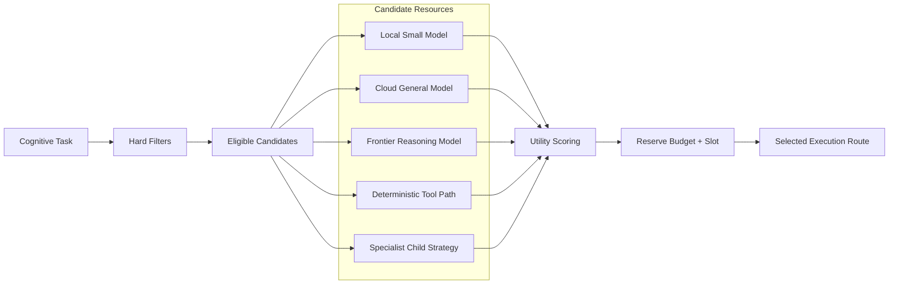

### Principle

The scheduler asks:

> What is the cheapest admissible resource that can solve this task under the current constraints?

Not:

> What is the default model?

---

# 10. Transaction and fork model

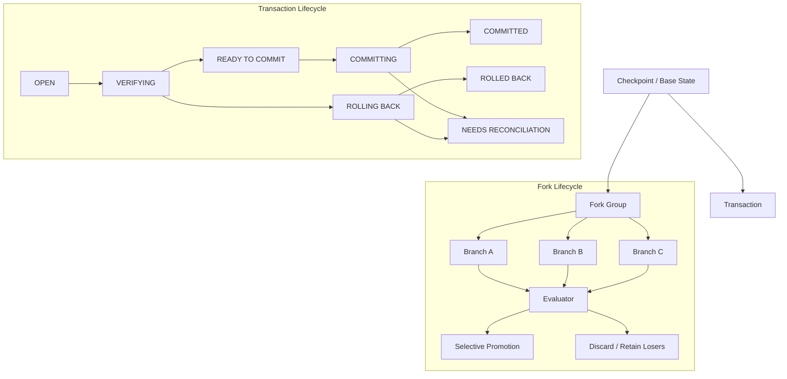

### Important distinction

- **transaction** — staged isolated work with commit/rollback/reconciliation semantics;
- **fork** — exploration of alternative future branches.

---

# 11. Safe execution editing

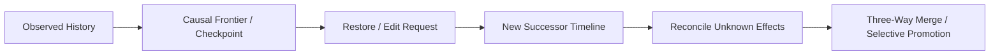

### Law

Restore or execution editing never erases already observed effects.

It creates a new successor timeline anchored at a safe causal frontier.

---

# 12. Attach / detach TUI protocol

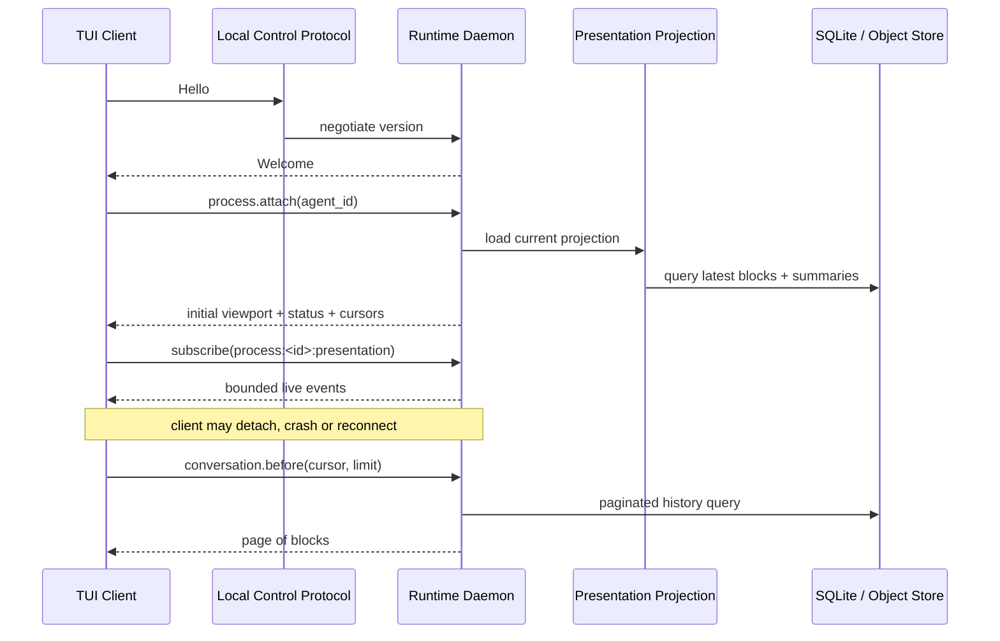

### Property

A very old session can be reattached without transferring or rendering its entire lifetime history.

---

# 13. Storage layout

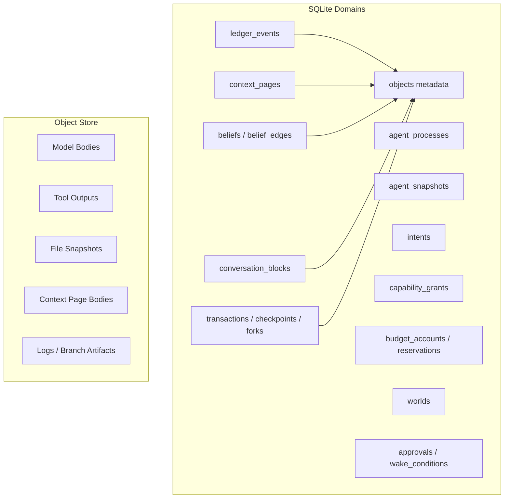

---

# 14. Foundation implementation map

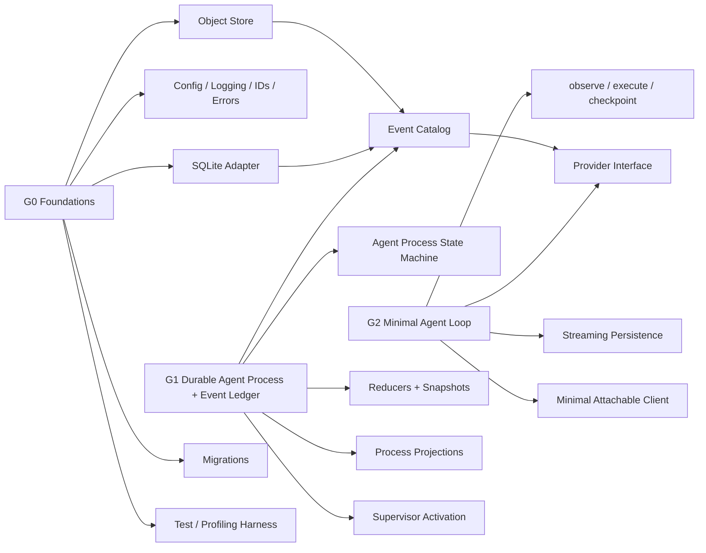

### Usage

This diagram is the visual bridge between A0 architecture and implementation planning.

---

# Diagram maintenance rule

Whenever a high-coupling architecture change is accepted, update:

1. the relevant subsystem contract;
2. the architecture decision log if the decision changed;
3. this document if the visual system shape changed.

These diagrams are part of the architecture baseline, not decoration.
